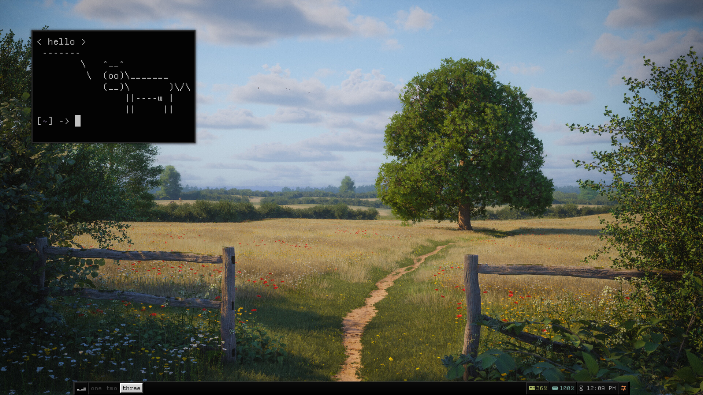

<h1 align="center">dotfiles</h1>

<p align="center">
  
</p>

---

## stack

| component | tool |
|-----------|------|
| **wm** | Mango  |
| **bar** | Waybar |
| **launcher** | Rofi |
| **notifications** | Quickshell |
| **osd** | Swayosd |
| **terminal** | foot |
| **shell** | Zsh |
| **editor** | Neovim |
| **multiplexer** | Tmux |
| **file manager** | Yazi (tui), Thunar (gui) |
| **music** | MPD + rmpc |
| **pdf** | Zathura |
| **wallpaper** | awww |
| **idle / lock** | swayidle + Hyprlock |
| **clipboard** | Cliphist |
| **color picker** | Hyprpicker |
| **gamma** | Wlsunset |
| **gtk** | Base16 Bark theme, Papirus-Dark icons |
| **font** | DepartureMono Nerd Font|


## install

create symlinks to ~/.config and ~
```bash
git clone https://github.com/k4rkie/dotfiles.git 
cd ~/dotfiles
./install.sh 
```

**For help**
```bash
./install.sh --help 
```

